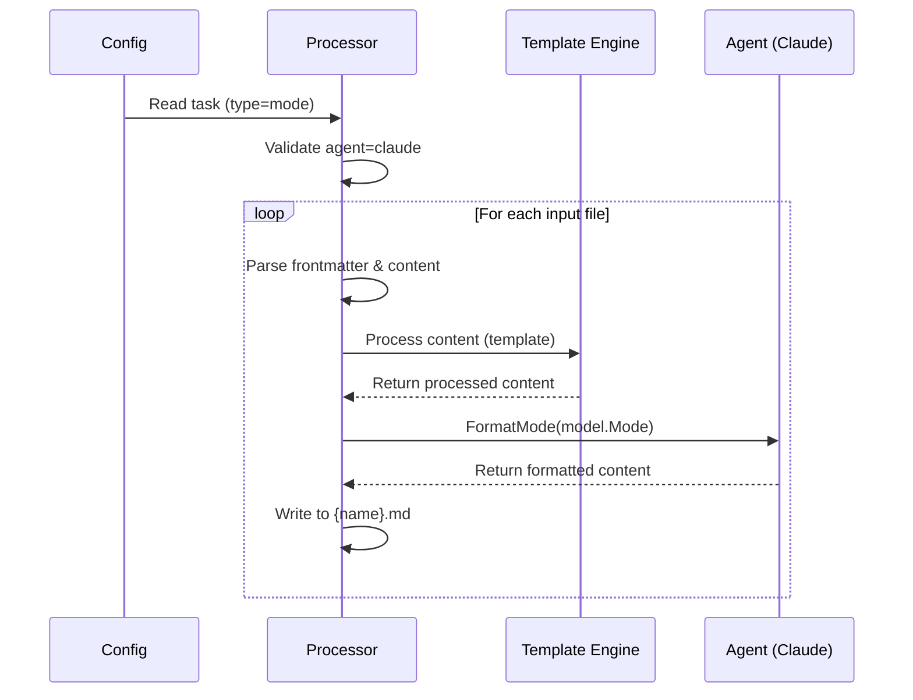

# Subagent Support Design Document

## 目的と背景

Claude Codeのsubagents機能をagent-syncでサポートするため、以下の課題を解決：

1. サブエージェント定義の一元管理
2. テンプレートエンジンによる動的生成
3. プロジェクト/ユーザーレベルの自動デプロイ

## アーキテクチャ変更

### 設定スキーマ拡張

```go
// internal/config/config.go
const TaskTypeMode = "mode" // 追加

type Task struct {
    Type string `yaml:"type"` // "mode"を許可
}
```

## フロントマター設計

agent-syncにおけるmarkdownファイルのフロントマターは以下のように定義されます。

```markdown
---
claude:
  name: code-reviewer
  description: Expert code review specialist
  tools: [Read, Grep, Glob, Bash]
---
Content with {{ template }} processing...

### 新しいモデル定義
```go
// internal/model/mode.go
type Mode struct {
    Claude      *ClaudeCodeMode `yaml:"claude"`
    Content     string
}
type ClaudeCodeMode struct {
    Name        string `yaml:"name"`
    Description string `yaml:"description"`
    Tools       string `yaml:"tools,omitempty"`
}
```

### エージェントインターフェース拡張
```go
// internal/agent/agent.go
type Agent interface {
    FormatMode(model.Mode) (string, error) // 追加
    ModePath(bool) string // 追加
}
```

## 設定ファイル仕様
```yaml
tasks:
  - type: mode
    inputs: [modes/*.md]
    outputs:
      - agent: claude
        outputPath: ".claude/agents/" # オプション
```

## 処理フロー



## テンプレート処理仕様
- **適用範囲**: コンテンツ部分のみ（フロントマターは対象外）
- **特別な関数**: `ifClaude`などエージェント固有関数が使用可能
- **制限**: ファイル名の動的生成不可（nameフィールド固定）

## 出力パス解決

```go
func (p *ModeProcessor) GetOutputPath(agent agent.Agent, outputPath string) string {
    if outputPath == "" {
        return agent.ModePath(p.userScope)
    }
    return outputPath
}
```

## エラーハンドリングポリシー

| エラー種別 | 重大度 | 処理方法 |
|------------|--------|----------|
| 非対応エージェント | High | タスク失敗 |
| 必須フィールド欠如 | High | タスク失敗 |
| テンプレートエラー | Medium | ファイルスキップ |

## テスト計画

1. **ユニットテスト**:
   - パーサー: フロントマター解析の検証
   - テンプレート: コンテンツ処理の検証
2. **統合テスト**:
   - エンドツーエンドのファイル生成
   - クロスプラットフォームパス解決

---
**設計承認者**: Roo (Architect Mode)  
**最終更新日**: 2025-07-30